# Отчет по лабораторным работам (Вариант 3)

# Лабораторная работа 1

## Анализ предметной области

### Список бизнес-правил:

1) В системе определены следующие роли: библиограф, оператор, заведующий, читатель.
2) Каждый пользователь должен иметь только одну роль/должность.
3) Заведующий обладает правами библиографа и оператора.
4) Оператор регистрирует читателей.
5) Оператор оформляет читательский билет.
6) Оператор выдает пароль доступа читателю.
7) Читательский билет действует в течение определенного срока.
8) По истечении срока действия билета оператор либо продлевает старый билет, либо выдает новый.
9) Продление можно совершить только в течение месяца после окончания срока действия билета.
10) Все операции конкретного читателя выполняются по его читательскому билету.
11) Библиограф ведет учет изданий (каталог).
12) Издание может иметь несколько авторов.
13) Рубрики организованы по иерархическому принципу.
14) Текущее количество книг увеличивается при возврате, уменьшается при выдаче.
15) Читатель создает запрос на получение литературы оператору.
16) В запросе может быть указано несколько изданий.
17) В запросе фиксируется дата его оформления.
18) Читатель может: просматривать список выданных книг, формировать запрос на выдачу, просматривать ответы на запросы.
19) Оператор должен обрабатывать запрос и формировать документ выдачи книг.
20) Выдача книг допускается, только если соблюдены правила:
    - Одновременно на руках читателя может находиться не более 10 изданий.
    - Каждое издание выдается на определенный срок, после окончания которого должна быть возвращена или продлена.
    - Допускается не более 5 продлений для одного выданного издания.
21) Оператор должен иметь возможность оформить возврат или продление.
22) При сдаче или продлении книги данные запроса идентичны запросу на выдачу.
23) Если выдача невозможна, то оператор формирует отказ с причиной отказа.
24) Причина отказа может быть выбрана из списка причин отказов.
25) Заведующий ежемесячно должен иметь возможность получать информацию о задолженностях со стороны читателей.
26) Заведующий должен иметь возможность регистрировать новых сотрудников.
27) Заведующим может выполнять обязанности библиографа или оператора.

### Сущности:

- E1 Пользователь
- E2 Роль пользователя
- E3 Читательский билет
- E4 Раздел (рубрика)
- E5 Автор
- E6 Издательство
- E7 Издание
- E8 Издание-Автор
- E9 Запрос на книги
- E10 Экземпляр запроса на книги
- E11 Документ выдачи книг
- E12 Экземпляр документа выдачи книг
- E13 Документ отказа
- E14 Экземпляр документа отказа
- E15 Список причин отказа

### Матрица связей сущностей:

|     | E1 | E2 | E3 | E4  | E5 | E6 | E7 | E8 | E9 | E10 | E11 | E12 | E13 | E14 | E15 |
|-----|----|----|----|-----|----|----|----|----|----|-----|-----|-----|-----|-----|-----|
| E1  | -  | +  | +  |     |    |    | +  |    |    |     | +   |     | +   |     |     |
| E2  | +  | -  |    |     |    |    |    |    |    |     |     |     |     |     |     |
| E3  | +  |    | -  |     |    |    |    |    | +  |     | +   |     |     |     |     |
| E4  |    |    |    | -/+ |    |    | +  |    |    |     |     |     |     |     |     |
| E5  |    |    |    |     | -  |    | +  | +  |    |     |     |     |     |     |     |
| E6  |    |    |    |     |    | -  | +  |    |    |     |     |     |     |     |     |
| E7  | +  |    |    | +   | +  | +  | -  | +  | +  | +   | +   | +   |     | +   |     |
| E8  |    |    |    |     | +  |    | +  | -  |    |     |     |     |     |     |     |
| E9  |    |    | +  |     |    |    | +  |    | -  | +   | +   |     | +   |     |     |
| E10 |    |    |    |     |    |    | +  |    | +  | -   |     |     |     |     |     |
| E11 | +  |    | +  |     |    |    | +  |    | +  |     | -   | +   |     |     |     |
| E12 |    |    |    |     |    |    | +  |    |    |     | +   | -   |     |     |     |
| E13 | +  |    |    |     |    |    |    |    | +  |     |     |     | -   | +   | +   |
| E14 |    |    |    |     |    |    | +  |    |    |     |     |     | +   | -   | +   |
| E15 |    |    |    |     |    |    |    |    |    |     |     |     | +   | +   | -   |

# Лабораторная работа 2

## Концептуальное проектирование базы данных

### ER-диаграмма

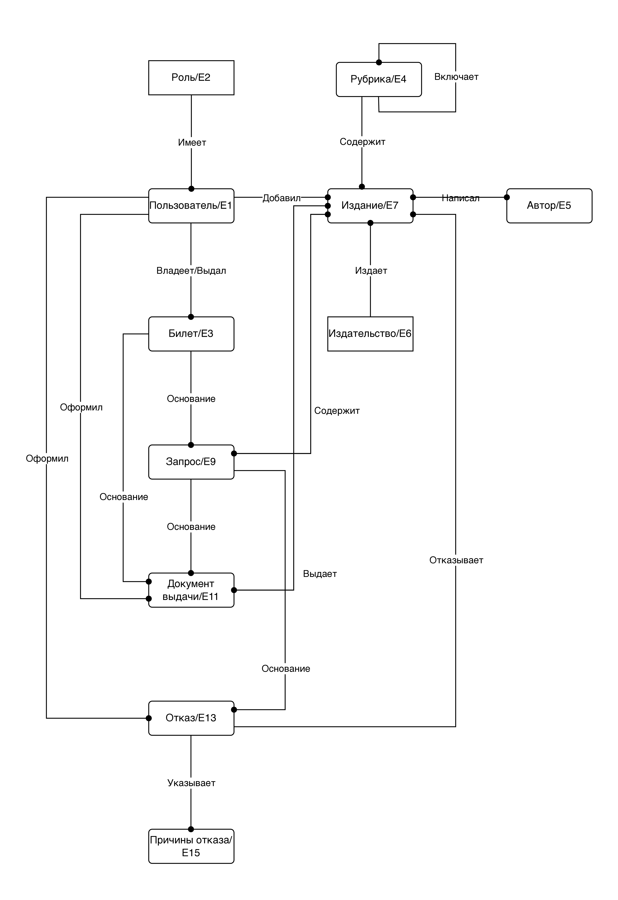

### KB-диаграмма


### Таблица атрибутов и доменов

#### E1. Пользователь

| Атрибут      | Домен        | Ограничения                               |
|--------------|--------------|-------------------------------------------|
| UserID       | BIGINT       | GENERATED ALWAYS AS IDENTITY, PRIMARY KEY |
| Passport     | VARCHAR(20)  | NOT NULL, UNIQUE                          |
| RoleID       | INT          | NOT NULL, FOREIGN KEY                     |
| UserIDRegBy  | BIGINT       | FOREIGN KEY                               |
| LastName     | VARCHAR(100) | NOT NULL                                  |
| FirstName    | VARCHAR(100) | NOT NULL                                  |
| MiddleName   | VARCHAR(100) |                                           |
| Address      | VARCHAR(300) |                                           |
| Phone        | VARCHAR(20)  | NOT NULL                                  |
| PasswordHash | VARCHAR(255) | NOT NULL                                  |

#### E2. Роль

| Атрибут  | Домен       | Ограничения                               |
|----------|-------------|-------------------------------------------|
| RoleID   | INT         | GENERATED ALWAYS AS IDENTITY, PRIMARY KEY |
| RoleCode | INT         | NOT NULL, UNIQUE                          |
| RoleName | VARCHAR(20) | NOT NULL, UNIQUE                          |

#### E3. Читательский билет

| Атрибут        | Домен       | Ограничения                               |
|----------------|-------------|-------------------------------------------|
| TicketID       | BIGINT      | GENERATED ALWAYS AS IDENTITY, PRIMARY KEY |
| TicketNumber   | VARCHAR(20) | NOT NULL, UNIQUE                          |
| OwnerUserID    | BIGINT      | NOT NULL, FOREIGN KEY                     |
| OperatorUserID | BIGINT      | NOT NULL, FOREIGN KEY                     |
| IssueDate      | DATE        | NOT NULL                                  |
| ExpireDate     | DATE        | NOT NULL, CHECK (ExpireDate >= IssueDate) |
| IsActive       | BOOLEAN     | NOT NULL, DEFAULT TRUE                    |

#### E4. Рубрика

| Атрибут           | Домен        | Ограничения                                      |
|-------------------|--------------|--------------------------------------------------|
| RubricID          | BIGINT       | GENERATED ALWAYS AS IDENTITY, PRIMARY KEY        |
| ParentRubricID    | BIGINT       | FOREIGN KEY, UNIQUE (ParentRubricID, RubricName) |
| RubricName        | VARCHAR(200) | NOT NULL, UNIQUE (ParentRubricID, RubricName)    |
| RubricDescription | VARCHAR(200) |                                                  |

#### E5. Автор

| Атрибут    | Домен        | Ограничения                               |
|------------|--------------|-------------------------------------------|
| AuthorID   | BIGINT       | GENERATED ALWAYS AS IDENTITY, PRIMARY KEY |
| LastName   | VARCHAR(100) | NOT NULL                                  |
| FirstName  | VARCHAR(100) | NOT NULL                                  |
| MiddleName | VARCHAR(100) |                                           |
| Bio        | TEXT         |                                           |

#### E6. Издательство

| Атрибут       | Домен        | Ограничения                               |
|---------------|--------------|-------------------------------------------|
| PublisherID   | BIGINT       | GENERATED ALWAYS AS IDENTITY, PRIMARY KEY |
| PublisherName | VARCHAR(200) | NOT NULL, UNIQUE (PublisherName, City)    |
| City          | VARCHAR(100) | NOT NULL, UNIQUE (PublisherName, City)    |
| Description   | VARCHAR(500) |                                           |

#### E7. Издание

| Атрибут       | Домен        | Ограничения                                                                                                |
|---------------|--------------|------------------------------------------------------------------------------------------------------------|
| EditionID     | BIGINT       | GENERATED ALWAYS AS IDENTITY, PRIMARY KEY                                                                  |
| RubricID      | BIGINT       | NOT NULL, FOREIGN KEY                                                                                      |
| PublisherID   | BIGINT       | NOT NULL, FOREIGN KEY, UNIQUE (Title, PublisherID, PublishYear)                                            |
| UserIDAddedBy | BIGINT       | NOT NULL, FOREIGN KEY                                                                                      |
| Title         | VARCHAR(200) | NOT NULL, UNIQUE (Title, PublisherID, PublishYear)                                                         |
| PublishYear   | INT          | NOT NULL, UNIQUE (Title, PublisherID, PublishYear), CHECK (PublishYear <= EXTRACT(YEAR FROM CURRENT_DATE)) |
| Pages         | INT          | NOT NULL, CHECK (Pages > 0)                                                                                |
| Annotation    | TEXT         |                                                                                                            |
| TotalCount    | INT          | NOT NULL, CHECK (TotalCount >= 0)                                                                          |
| CurrentCount  | INT          | NOT NULL, CHECK (CurrentCount >= 0 AND CurrentCount <= TotalCount)                                         |

#### E8. Издание-Автор

| Атрибут     | Домен   | Ограничения                                              |
|-------------|---------|----------------------------------------------------------|
| EditionID   | BIGINT  | NOT NULL, PRIMARY KEY (EditionID, AuthorID), FOREIGN KEY |
| AuthorID    | BIGINT  | NOT NULL, PRIMARY KEY (EditionID, AuthorID), FOREIGN KEY |
| AuthorOrder | INTEGER | NOT NULL, DEFAULT 1                                      |

#### E9. Запрос на книги

| Атрибут     | Домен       | Ограничения                                                                            |
|-------------|-------------|----------------------------------------------------------------------------------------|
| RequestID   | BIGINT      | GENERATED ALWAYS AS IDENTITY, PRIMARY KEY                                              |
| TicketID    | BIGINT      | NOT NULL, FOREIGN KEY                                                                  |
| RequestDate | DATE        | NOT NULL, DEFAULT CURRENT_DATE                                                         |
| Status      | VARCHAR(20) | NOT NULL, DEFAULT 'NEW', CHECK (Status IN ('NEW', 'PROCESSED', 'CLOSED', 'CANCELLED')) |

#### E10. Экземпляр запроса

| Атрибут   | Домен  | Ограничения                                               |
|-----------|--------|-----------------------------------------------------------|
| RequestID | BIGINT | NOT NULL, PRIMARY KEY (RequestID, EditionID), FOREIGN KEY |
| EditionID | BIGINT | NOT NULL, PRIMARY KEY (RequestID, EditionID), FOREIGN KEY |
| Qty       | BIGINT | NOT NULL, CHECK (Qty > 0)                                 |

#### E11. Документ выдачи

| Атрибут        | Домен  | Ограничения                               |
|----------------|--------|-------------------------------------------|
| IssueDocID     | BIGINT | GENERATED ALWAYS AS IDENTITY, PRIMARY KEY |
| TicketID       | BIGINT | NOT NULL, FOREIGN KEY                     |
| OperatorUserID | BIGINT | NOT NULL, FOREIGN KEY                     |
| RequestID      | BIGINT | FOREIGN KEY                               |
| IssueDate      | DATE   | NOT NULL, DEFAULT CURRENT_DATE            |

#### E12. Экземпляр выдачи

| Атрибут       | Домен   | Ограничения                                                |
|---------------|---------|------------------------------------------------------------|
| IssueDocID    | BIGINT  | NOT NULL, PRIMARY KEY (IssueDocID, EditionID), FOREIGN KEY |
| EditionID     | BIGINT  | NOT NULL, PRIMARY KEY (IssueDocID, EditionID), FOREIGN KEY |
| DueDate       | DATE    | NOT NULL                                                   |
| ReturnDate    | DATE    |                                                            |
| RenewCount    | INTEGER | NOT NULL, DEFAULT 0, CHECK (RenewCount BETWEEN 0 AND 5)    |
| LastRenewDate | DATE    |                                                            |

#### E13. Документ отказа

| Атрибут        | Домен  | Ограничения                               |
|----------------|--------|-------------------------------------------|
| RefusalDocID   | BIGINT | GENERATED ALWAYS AS IDENTITY, PRIMARY KEY |
| RequestID      | BIGINT | NOT NULL, FOREIGN KEY                     |
| OperatorUserID | BIGINT | NOT NULL, FOREIGN KEY                     |
| RefusalDate    | DATE   | NOT NULL, DEFAULT CURRENT_DATE            |

#### E14. Экземпляр отказа

| Атрибут      | Домен        | Ограничения                                                                                  |
|--------------|--------------|----------------------------------------------------------------------------------------------|
| RefusalDocID | BIGINT       | NOT NULL, PRIMARY KEY (RefusalDocID, EditionID), FOREIGN KEY                                 |
| EditionID    | BIGINT       | NOT NULL, PRIMARY KEY (RefusalDocID, EditionID), FOREIGN KEY                                 |
| ReasonID     | BIGINT       | FOREIGN KEY REFERENCES E15(ReasonID), CHECK (ReasonID IS NOT NULL OR ReasonText IS NOT NULL) |
| ReasonText   | VARCHAR(500) | CHECK (ReasonID IS NOT NULL OR ReasonText IS NOT NULL)                                       |

#### E15. Причина отказа

| Атрибут           | Домен        | Ограничения                               |
|-------------------|--------------|-------------------------------------------|
| ReasonID          | BIGINT       | GENERATED ALWAYS AS IDENTITY, PRIMARY KEY |
| ReasonCode        | VARCHAR(20)  | NOT NULL, UNIQUE                          |
| ReasonName        | VARCHAR(200) | NOT NULL, UNIQUE                          |
| ReasonDescription | TEXT         |                                           |

# Лабораторная работа 3

## Функциональная модель системы

### FA-диаграмма


# Лабораторная работа 4

## Физическая реализация базы данных
### SQL-скрипт создания схемы: [library_db/sql/create.sql](library_db/sql/create.sql)
### SQL-скрипт начального наполнения: [library_db/sql/seed.sql](library_db/sql/seed.sql)
### Скрипт генерации тестовых данных: [library_db/scripts/generate_test_data.py](library_db/scripts/generate_test_data.py) 
### Инструкция по запуску:
Для заполнения БД тестовыми данными необходимо:  
1. Поднять postgresql
2. Выполнить скрипт `./restart.sh` [library_db/scripts/restart.sh](library_db/scripts/restart.sh) 

# Лабораторная работа 5
## Аналитические SQL-запросы
### 1. Отчет по десяти наиболее популярным изданиям с расширенной статистикой
#### [library_db/sql/queries/01_top_10_popular_editions.sql](library_db/sql/queries/01_top_10_popular_editions.sql)
Сначала в CTE собирается список авторов для каждого издания, затем отдельно считается статистика выдач.
После формируется статистика отказов по издательствам и через оконную функцию выбирается самая
частая причина отказа. В отдельном CTE определяется последний читатель по каждому изданию. 
В итоге все данные объединяются и выбираются 10 самых
популярных изданий с сортировкой по убыванию количества выдач.  
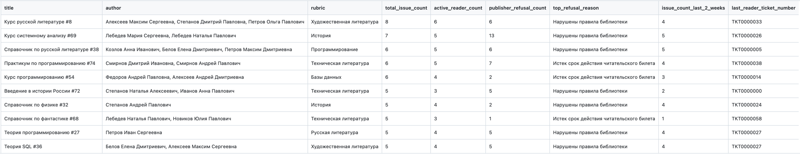

### 2. Выявление читателей с максимальной задолженностью по времени
#### [library_db/sql/queries/02_readers_with_max_overdue.sql](library_db/sql/queries/02_readers_with_max_overdue.sql)
Сначала выбираются только читатели, затем оставляем только с действующим билетом. Далее анализируются отказы и 
определяются какие из них связаны с нарушением правил, а именно с просрочкой. После считаются суммарные дни просрочки
и выбирается пользователь с максимальной.

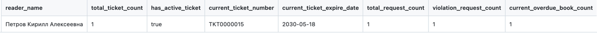

### 3. Статистика популярности рубрик за 2024 год
#### [library_db/sql/queries/03_rubric_popularity_2024.sql](library_db/sql/queries/03_rubric_popularity_2024.sql) от коммита 4b872d9b
Создается список всех месяцев через generate_series, затем собираются факты и на их основе считается популярность за 
месяц и год. После выбираются самая популярная рубрика в каждом месяце, а затем самая популярная книга среди рубрики.

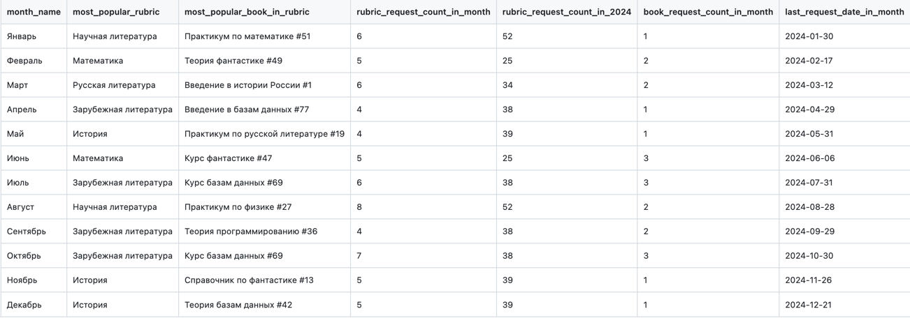

### 4. Анализ читателей, имеющих несколько читательских билетов
#### [library_db/sql/queries/04_readers_with_multiple_tickets.sql](library_db/sql/queries/04_readers_with_multiple_tickets.sql)
Сначала выбираются все читатели, затем в CTE по билетам оставляются только те пользователи,
у которых количество билетов больше 1. После считается суммарное количество заказанных изданий, 
количество просроченных изданий. В отдельной CTE выбирается самое часто заказываемое издание у читателя.

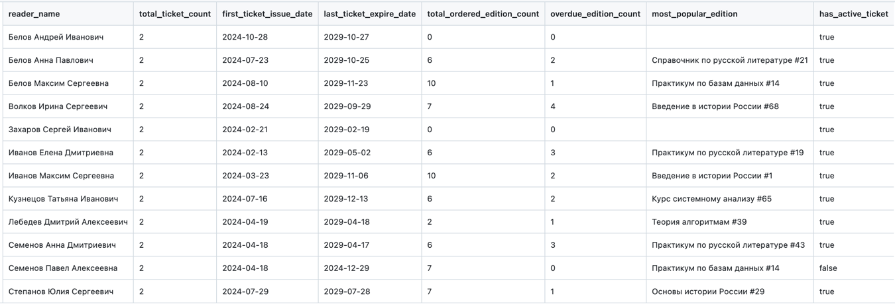

### 5. Отчет "Автор x Издательство"
#### [library_db/sql/queries/05_author_publisher_matrix.sql](library_db/sql/queries/05_author_publisher_matrix.sql)
Динамически формируется список столбцов, для каждого издательства создается выражение с CASE. 
Во внутреннем CTE собираются пары "автор-издательсво". После этого строится итоговая сводная таблица: 
авторы - строки, издательства - столбцы. Выполняется через курсор. 

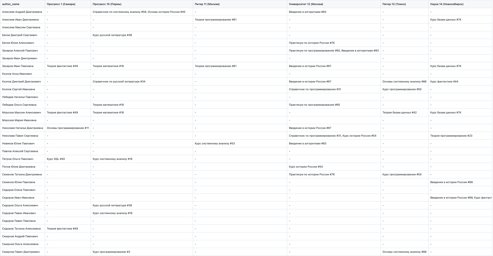


# Лабораторная работа 6
## Триггеры и хранимые процедуры 
### Триггер 1 - Контроль добавления изданий в запрос
#### [library_db/sql/triggers/01_request_item_guard.sql](library_db/sql/triggers/01_request_item_guard.sql)
Предназначен для контроля добавления изданий в запрос читателя с обязательной поддержкой multi-row вставок.
При попытке добавления издания в запрос система должна автоматически проверять корректность возможности выдачи.
Если читательский билет просрочен, если у читателя уже имеется 10 активных выдач,
если по изданию отсутствуют свободные экземпляры (текущее количество равно нулю) либо если
у читателя есть просроченные книги, позиция не должна добавляться в запрос.
Вместо этого фиксируется отказ по соответствующей позиции с указанием причины отказа и даты его формирования.
Все проверки должны корректно работать при одновременной вставке нескольких позиций в рамках одного запроса.
#### Тестовые сценарии: [library_db/sql/tests/triggers/01_request_item_guard_tests.sql](library_db/sql/tests/triggers/01_request_item_guard_tests.sql)

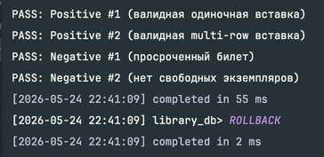


### Триггер 2 - Контроль иерархии рубрик
#### [library_db/sql/triggers/02_rubric_no_cycle.sql](library_db/sql/triggers/02_rubric_no_cycle.sql)
При изменении родительской рубрики система должна проверить, что в результате изменения не образуется цикл 
в иерархической структуре. Если новая связь приводит к образованию циклической зависимости, операция 
отменяется с выводом сообщения об ошибке.
#### Тестовые сценарии: [library_db/sql/tests/triggers/02_rubric_no_cycle_tests.sql](library_db/sql/tests/triggers/02_rubric_no_cycle_tests.sql)

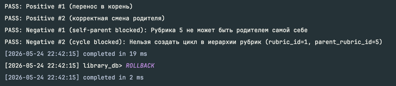
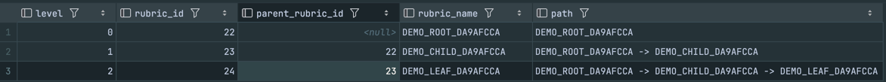
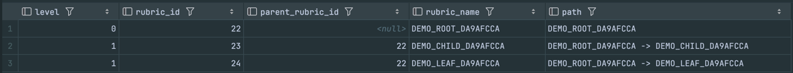

### Процедура 1 - Оформление возврата издания 
#### [library_db/sql/procedures/01_return_edition.sql](library_db/sql/procedures/01_return_edition.sql)
Процедура предназначена для оформления возврата издания. 
На вход передается номер издания и номер читательского билета. 
В рамках процедуры фиксируется факт возврата: записывается дата возврата и увеличивается текущее 
количество экземпляров издания. Если выдача была просрочена, пользователю выводится информационное 
сообщение с указанием количества полных дней просрочки; при необходимости допускается служебная 
фиксация факта просрочки перед оформлением возврата. Если после выполнения операции по соответствующему
документу выдачи возвращены все издания, в документе устанавливается отметка «все издания возвращены».
#### Тестовые сценарии: [library_db/sql/tests/procedures/01_return_edition_tests.sql](library_db/sql/tests/procedures/01_return_edition_tests.sql)


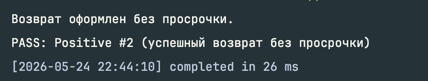
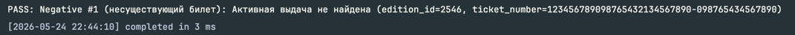
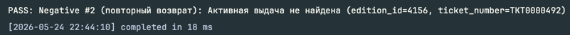

### Процедура 2 - Очистка иерархии рубрик от неиспользуемых элементов
#### [library_db/sql/procedures/02_cleanup_unused_rubrics.sql](library_db/sql/procedures/02_cleanup_unused_rubrics.sql)
Процедура не принимает входных параметров. В ходе выполнения удаляются все рубрики, 
в которых отсутствуют издания. Если рубрика имеет дочерние рубрики и во всей 
подветке также отсутствуют издания, удаляется вся подветка целиком. 
По завершении процедуры выводится список названий всех удалённых рубрик.
#### Тестовые сценарии: [library_db/sql/tests/procedures/02_cleanup_unused_rubrics_tests.sql](library_db/sql/tests/procedures/02_cleanup_unused_rubrics_tests.sql)

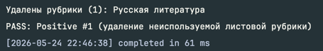
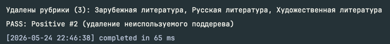
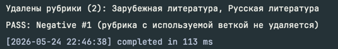
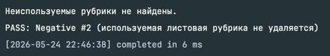

# Лабораторная работа 7
## Оптимизация и анализ выполнения запросов
### Планы выполнения до и после:
Первый и второй индексы написаны для 2-го запроса, третий - для 1-го.

- [План выполнения для 2-го запроса ДО](library_db/sql/indexes/output/02_before.csv)
- [План выполнения для 1-го запроса ДО](library_db/sql/indexes/output/01_before.csv)

- [План выполнения для 2-го запроса ПОСЛЕ 1-го индекса](library_db/sql/indexes/output/02_after_01idx.csv)
- [План выполнения для 2-го запроса ПОСЛЕ 2-го индекса](library_db/sql/indexes/output/02_after_02idx.csv)
- [План выполнения для 1-го запроса ПОСЛЕ 3-го индекса](library_db/sql/indexes/output/01_after_03idx.csv)


### Таблица сравнения показателей
| Индекс | ДО, мс  | ПОСЛЕ, мс |
|--------|---------|-----------|
| 1      | 84.152  | 80.297    |
| 2      | 84.152  | 82.415    |
| 3      | 122.160 | 98.728    |


### Причины выбора именно таких индексов
#### 1-й индекс:
[library_db/sql/indexes/01_idx_q02_issue_item_open_due.sql](library_db/sql/indexes/01_idx_q02_issue_item_open_due.sql)

Нам нужны только невозвращенные книги, значит можно брать только те, у которых return_date IS NULL с due_date < CURRENT_DATE.
До применения индекса был `Seq Scan on issue_item`, после стало `Index Only Scan using idx_q02_issue_item_open_due`, `Heap Fetches: 0`

#### 2-й индекс:
[library_db/sql/indexes/02_idx_q02_ticket_current_covering.sql](library_db/sql/indexes/02_idx_q02_ticket_current_covering.sql)

Сделан для `ticket`, отдает данные, сразу отсортированные для оконной функции.
До применения был `sort` и `Seq Scan on ticket`, после стало `Index Only Scan`

#### 3-й индекс: 
[library_db/sql/indexes/03_idx_q01_edition_author_order_author.sql](library_db/sql/indexes/03_idx_q01_edition_author_order_author.sql)

Сделан для `edition_authors`, улучшает сортировку авторов по изданию

# Лабораторная работа 8
## Транзакции и уровни изоляции
### 1. Non-repeatable read
Первая транзакция дважды читает одну и ту же строку и ожидает, что внутри ее транзакции значение не изменится.

При `READ COMMITTED` второе чтение увидит уже зафиксированное изменение второй транзакции.

Консоль 1:

```sql
BEGIN ISOLATION LEVEL READ COMMITTED;

SELECT edition_id, title, current_count
FROM edition
WHERE edition_id = 81;
```

Ожидаем `current_count = 1`

Консоль 2:

```sql
BEGIN;

UPDATE edition
SET current_count = current_count - 1
WHERE edition_id = 81;

COMMIT;
```

Консоль 1:

```sql
SELECT edition_id, title, current_count
FROM edition
WHERE edition_id = 81;

COMMIT;
```

Фактически `current_count = 0`

### 2. Phantom read

Первая транзакция считает строки по условию и ожидает, что при повторном чтении набор строк останется прежним.

Консоль 1:

```sql
BEGIN ISOLATION LEVEL READ COMMITTED;

SELECT COUNT(*) AS new_requests_today
FROM book_request
WHERE ticket_id = 1
  AND request_date = CURRENT_DATE
  AND status = 'NEW';
```

Ожидаем `0`

Консоль 2:

```sql
BEGIN;

INSERT INTO book_request (ticket_id, request_date, status)
VALUES (1, CURRENT_DATE, 'NEW')
RETURNING request_id, ticket_id, request_date, status;

COMMIT;
```

Консоль 1:

```sql
SELECT COUNT(*) AS new_requests_today
FROM book_request
WHERE ticket_id = 1
  AND request_date = CURRENT_DATE
  AND status = 'NEW';

COMMIT;
```

Фактически получим `1`

На `READ COMMITTED` следующий `SELECT` первой транзакции делает новый снимок и видит эту строку

### 3. Write skew

Каждая транзакция проверяет общий инвариант, видит две доступные книги.
Транзакции обновят разные строки, обе успешно зафиксируются, но инвариант будет нарушен.

Консоль 1:

```sql
BEGIN ISOLATION LEVEL REPEATABLE READ;

SELECT COUNT(*) AS available_sql_books
FROM edition
WHERE edition_id IN (928, 1247)
  AND current_count > 0;
```

Ожидаем `2`

Консоль 2:

```sql
BEGIN ISOLATION LEVEL REPEATABLE READ;

SELECT COUNT(*) AS available_sql_books
FROM edition
WHERE edition_id IN (928, 1247)
  AND current_count > 0;
```

Ожидаем `2`

Консоль 1:

```sql
UPDATE edition
SET current_count = 0
WHERE edition_id = 928;

SELECT edition_id, title, current_count
FROM edition
WHERE edition_id IN (928, 1247)
ORDER BY edition_id;
```

Первая транзакция видит, что `edition_id = 1247` доступна.

Консоль 2:

```sql
UPDATE edition
SET current_count = 0
WHERE edition_id = 1247;

SELECT edition_id, title, current_count
FROM edition
WHERE edition_id IN (928, 1247)
ORDER BY edition_id;
```

Вторая транзакция видит, что `edition_id = 928` доступна.

Консоль 1:

```sql
COMMIT;
```

Консоль 2:

```sql
COMMIT;
```

Любая консоль:

```sql
SELECT edition_id, title, current_count
FROM edition
WHERE edition_id IN (928, 1247)
ORDER BY edition_id;

SELECT COUNT(*) AS available_sql_books_after_commit
FROM edition
WHERE edition_id IN (928, 1247)
  AND current_count > 0;
```

Фактически получим `0` доступных книг

### 4. SAVEPOINT и ROLLBACK TO

```sql
BEGIN;

SELECT edition_id, title, current_count
FROM edition
WHERE edition_id = 5;
```

Ожидаем `current_count = 4`

```sql
UPDATE edition
SET current_count = 3
WHERE edition_id = 5;

SAVEPOINT before_wrong_change;

UPDATE edition
SET current_count = 0
WHERE edition_id = 5;

SELECT edition_id, title, current_count
FROM edition
WHERE edition_id = 5;
```

Сейчас  `current_count = 0`

```sql
ROLLBACK TO SAVEPOINT before_wrong_change;

SELECT edition_id, title, current_count
FROM edition
WHERE edition_id = 5;

COMMIT;
```

После `ROLLBACK TO SAVEPOINT` будет `current_count = 3`.

